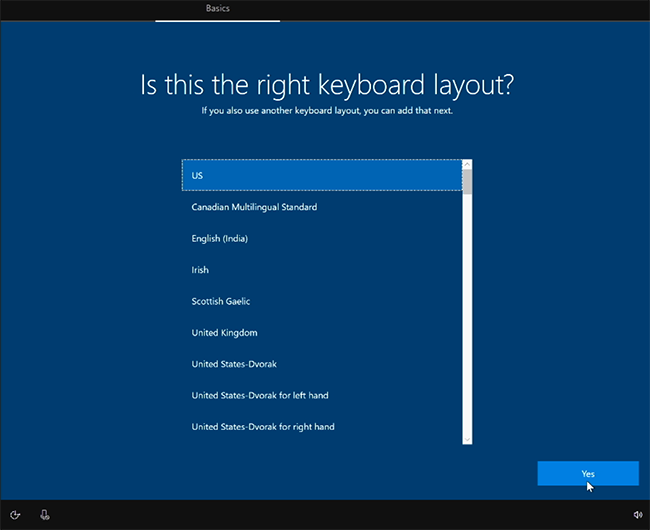
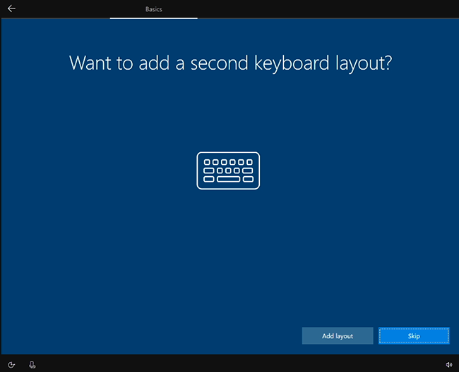
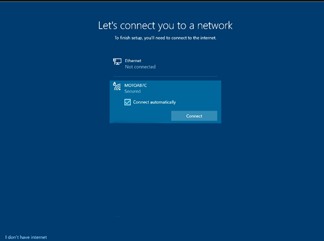
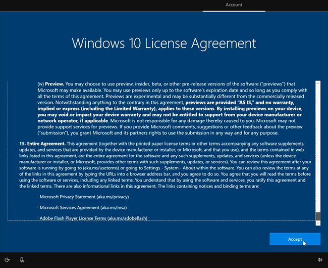
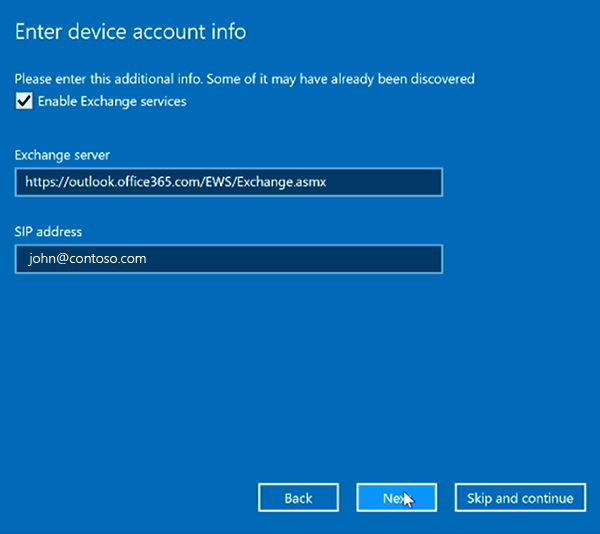
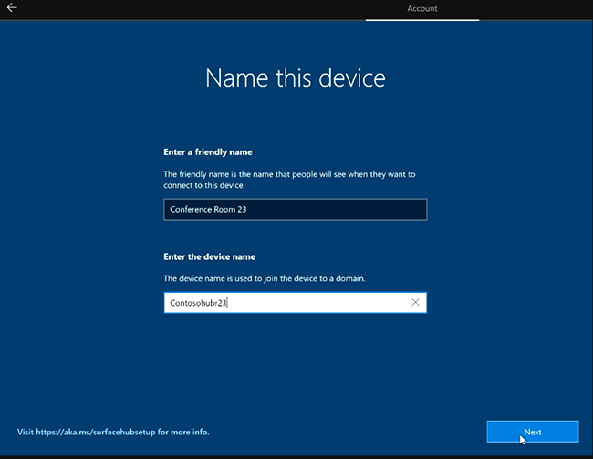
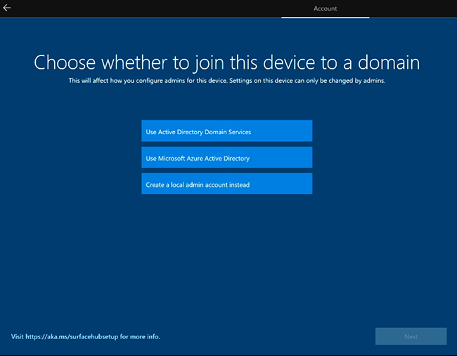
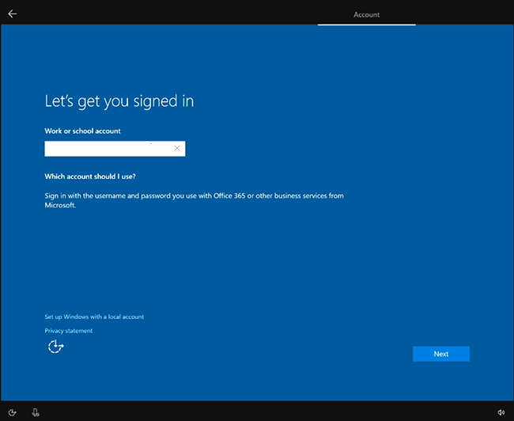

# First time setup for Surface Hub

When you first start Surface Hub, the device automatically enters first time Setup mode to guide you through account configuration and related settings.

> [!TIP]
> If managing multiple Surface Hubs, you can automate the entire setup process with a [Provisioning package](#use-provisioning-packages) to ensure a consistent experience.

## Get started

1. By default, Cortana is enabled to guide you through the process. To turn off Cortana assistance, select the microphone icon.
:::image type="content" source="images/hub-setup-cortana.png" alt-text="Cortana is enabled to guide you through the process":::

2. **Select your region.** Confirm the auto-detected region and select **Yes**.

> [!div class="mx-imgBorder"]
> 

3. **Confirm keyboard layout.** Select **Yes**.
> [!div class="mx-imgBorder"]
> 

4. To add a second keyboard, select **Add layout**. Otherwise, select **Skip**.

> [!div class="mx-imgBorder"]
> 

 5. **Connect to a network.** If you have already attached an Ethernet cable, Surface Hub automatically connects to your network. Alternatively, you can connect to a wireless network. **Note:** You cannot connect to a wireless network in hotspots (captive portals) that redirect sign-in requests to a provider's website. Select **Next**.

> [!div class="mx-imgBorder"]
> 

6. **Accept Windows 10 License Agreement.** Select **Accept**.

> [!div class="mx-imgBorder"]
> 

7. Enter Device account info using either a UPN address (user@contoso.com) or a down-level domain address (CONTOSO\user). Use the format that matches your environment and enter the password.

| Environment                                              | Required format for device account |
| -------------------------------------------------------- | ---------------------------------- |
| Device account is hosted only online                     | username@contoso.com               |
| Device account is hosted only on-premises                | CONTOSO\user                       |
| Device account is hosted online and on-premises (hybrid) | CONTOSO\user                       |

> [!div class="mx-imgBorder"]
> 

8. Enter your password and select **Next.**

9. Surface Hub automatically detects Exchange server and SIP address info from the domain entered in the previous step. Or if needed, provide your Exchange server address and select **Next**.

> [!div class="mx-imgBorder"]
> 

10. **Name this device.** Enter a name for your device or use the suggested one. **Select Next**.

> [!div class="mx-imgBorder"]
> 

- The **Friendly name** is visible on the bottom left corner of Surface Hub 2S and is shown when projecting to the device.
- The **Device name** identifies the device when affiliated with Active Directory or Azure Active Directory, and when enrolling the device with Intune.

### Configure device admin accounts

You can only set up device admins during first time Setup. For more information, refer to [Surface Hub 2S device affiliation](/surface-hub/prepare-your-environment-for-surface-hub#device-affiliation).

1. **Choose type of admin account.** Select one of the following options: Active Directory Domain Services, Azure Active Directory, or Local admin.

> [!div class="mx-imgBorder"]
> 

### Active Directory Domain Services

1. If you intend to use Surface Hub in an on-premises environment, you can affiliate Hub with **Active Directory Domain Services**.  Enter the credentials of a user who has permissions to join the device to Active Directory.
2. Select the Active Directory Security Group containing members allowed to sign in to the Settings app on Surface Hub 2S.
3. Select **Finish**. The device will restart.

### Microsoft Azure Active Directory

1. If you intend to manage Surface Hub from the cloud using Microsoft Intune or an MDM provider, select **Microsoft Azure Active Directory**.
2. Select Next and sign in with a work or school account. If redirected, authenticate using your organization’s sign-in page and provide additional credentials if requested. Otherwise, enter your password and select **Next.**

> [!div class="mx-imgBorder"]
> 

### Local Administrator account

- Enter a username and a memorable password for your local admin. (If you forget the local admin password you will need to [recover your device](surface-hub-2s-recover-reset.md) and repeat the setup process.)  

> [!div class="mx-imgBorder"]
> 

### Choose privacy settings for your device

- Select from the available privacy settings and select **Accept.**

> [!div class="mx-imgBorder"]
> 

### Use provisioning packages

You can customize first time setup options, allowing you to ensure a consistent experience across multiple Surface Hubs.

1. To begin, review the documentation in [Create provisioning packages](provisioning-packages-for-surface-hub.md) and save the provisioning package to a USB thumb drive.
2. Insert the USB thumb drive into one of the USB ports before beginning the setup process.
3. When prompted, choose the provisioning package you’d like to use.
4. If you created a multiple devices CSV file, you will be able to choose a device configuration.
5. Follow the instructions to complete first time Setup.
