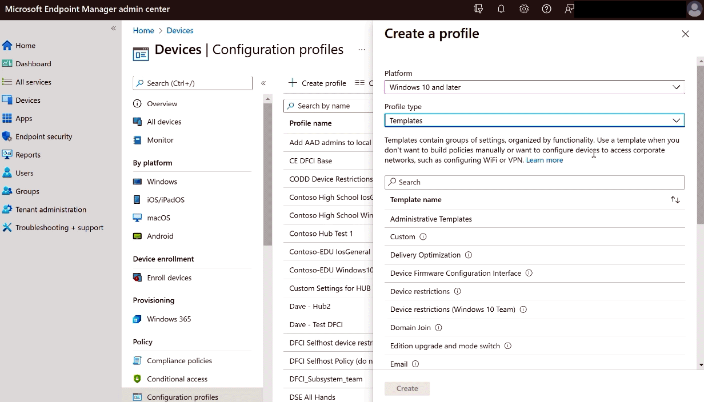

# Install Progressive Web Apps on Surface Hub

Admins can remotely install Progressive Web Apps (PWAs) on Surface Hubs via a mobile device management provider such as Microsoft Intune or a provisioning pack. PWAs function like installed native apps on supported platforms and function like regular websites on other browsers. When you install PWAs on Surface Hub, users can run them directly from the App menu.

To learn more, see [Overview of Progressive Web Apps (PWAs) - Microsoft Edge Development | Microsoft Docs](/microsoft-edge/progressive-web-apps-chromium/)

- [Install PWAs on Surface Hub via Intune](#install-pwas-via-intune)
- [Install PWAs on Surface Hub via provisioning package](#install-pwas-via-provisioning-package)

## Install PWAs via Intune

Use Intune or another MDM provider to install PWAs on Surface Hubs. To learn more, refer to [Manage settings with an MDM provider](manage-settings-with-mdm-for-surface-hub.md).

### Get started

1. Sign in to the Intune portal at  [**Microsoft Endpoint Manager admin center**](https://endpoint.microsoft.com/).
2. Go  to **Devices** > **Configuration** **Policies** > **Create profile** >
3. Under Platform, select Windows 10 and later. Under Profile **type,** select Templates**.** Under **Template name,** select **Administrative Templates.**
4. Select **Create.**



5. Name the profile, enter an optional description, and select **Next**.


### Configure force-installed Web Apps policy (Intune)

1. Select **Microsoft Edge Configuration** and in the Search box, enter **force-installed**, select **force-installed Web Apps**, and then select **Enabled**.


2. Under **URLs for Web Apps to be silently installed**, create an XML snippet from the following syntax or copy from the [example](#example-pwas) below. 

    ```
    [ { "url": "https://www.contoso.com ",   "default_launch_container": "window" }, 
    
   { "url": "https://www.fabrikam.com/",   "default_launch_container": "tab"  }, ]
    ```
    
#### Example PWAs

> [!TIP]
> This example installs PWAs for YoutTube, Webex, Zoom, and Uber.

```
    [
{ "url": "https://www.youtube.com/",       "default_launch_container": "window" },
{ "url": "https://signin.webex.com/join",  "default_launch_container": "window" },
{ "url": "https://zoom.us/join",           "default_launch_container": "window" },
{ "url": "https://www.uber.com/",          "default_launch_container": "tab"
]
```

- Enter the code snippet containing URLs for the apps you want to install.

3. Enter optional Scope tags as appropriate and select **Next.**
4. Assign to users as appropriate.
5. Assign to a group containing the Surface Hubs you wish to target. To learn more, see [Add groups to organize users and devices - Microsoft Intune | Microsoft Docs](/mem/intune/fundamentals/groups-add)
6. Review and then select **Create**.


7. Sync target devices as appropriate.
8. On Surface Hub, launch Edge. PWAs are installed and appear in the Start menu All apps list.

## Install PWAs via provisioning package

You can install PWAs by applying a provisioning package to target Surface Hubs using a USB drive. To learn more refer to [Create provisioning packages](/surface-hub/provisioning-packages-for-surface-hub#use-surface-hub-provisioning-wizard).

### Get started with provisioning

1. On a separate PC running Windows 10 or Windows 11, install [Windows Configuration Designer](https://www.microsoft.com/store/apps/9nblggh4tx22) (WCD) from the Microsoft Store.
2. In WCD, create a new Project. Select **Provision Desktop Devices,** provide a name for the project and choose **Finish.**
3. View all customizations: Select **Switch to advanced editor** and select **Yes** to confirm.

### Configure MSEdgePolicy

1. In the Available customizations tree navigation pane in WCD, navigate to **\Runtime Settings\ADMXIngestion\ConfigOperations\ADMXInstall\AppName**
2. In the customizations edit pane, enter the app name as **MSEdgePolicy** and select **Add**.
3. Select **AppName: MSEdgePolicy** in the customizations Tree and in the Edit pane, change **SettingType** to **Policy** and choose **Add**.
4. Select **SettingType: Policy** in the customizations Tree and in the Edit pane, set **AdmxFileUid** to **MSEdgePolicy,** and choose **Add**.
5. Select **AdmxFileUid: MSEdgePolicy** in the customizations Tree and in the Edit pane, set **MSEdgePolicy** by entering the following code as a single line of text:

    ```
    <policyDefinitions revision="1.0" schemaVersion="1.0" xmlns="http://www.microsoft.com/GroupPolicy/PolicyDefinitions">  <!--microsoft_edge version: 96.0.1054.53-->  <policyNamespaces>    <target namespace="Microsoft.Policies.Edge" prefix="microsoft_edge"/>    <using namespace="Microsoft.Policies.Windows" prefix="windows"/>  </policyNamespaces>  <resources minRequiredRevision="1.0"/>  <supportedOn>    <definitions>      <definition displayName="$(string.SUPPORTED_WIN7_V80)" name="SUPPORTED_WIN7_V80"/>     </definitions>  </supportedOn>  <categories>    <category displayName="$(string.microsoft_edge)" name="microsoft_edge"/>    <category displayName="$(string.microsoft_edge_recommended)" name="microsoft_edge_recommended"/>  </categories>  <policies>    <policy class="Both" displayName="$(string.WebAppInstallForceList)" explainText="$(string.WebAppInstallForceList_Explain)" key="Software\Policies\Microsoft\Edge" name="WebAppInstallForceList" presentation="$(presentation.WebAppInstallForceList)">      <parentCategory ref="microsoft_edge"/>      <supportedOn ref="SUPPORTED_WIN7_V80"/>      <elements>        <text id="WebAppInstallForceList" maxLength="1000000" valueName="WebAppInstallForceList"/>      </elements>    </policy>    </policies></policyDefinitions>
    ```

### Configure force-installed Web Apps policy (provisioning package)

1. In the customizations tree in WCD, go to: **\Runtime Settings\ADMXIngestion\ConfigADMXInstalledPolicy\AreaName**
2. In the customizations edit pane, enter the Areaname as **MSEdgePolicy~Policy~microsoft_edge,** select **Add**.
3. In the customizations Tree, select **AreaName: MSEdgePolicy~Policy~microsoft_edge** and in the Edit pane, set **Policy Name** to **WebAppInstallForceList** and select **Add**.
4. Select **PolicyName: WebAppInstallForceList** in the customizations Tree and in the Edit pane, for **WebAppInstallForceList** enter the following code as a single line of text.

 > [!TIP]
 > This example installs You Tube as a PWA. Replace the URL as appropriate. 

```
    <enabled/><data id="WebAppInstallForceList" value="[{&quot;url&quot;: &quot;https://www.youtube.com&quot;, &quot;create_desktop_shortcut&quot;: true, &quot;default_launch_container&quot;: &quot;window&quot;}]"/>
```

### Export provisioning package and apply to Surface Hubs

1. In the menu bar, select **Export**, select **Provisioning Package** and follow the prompts to generate the .ppkg file.
2. Insert an empty USB flash drive. Select output location to go to the location of the package. Copy the .ppkg file to the USB drive.
3. Apply the provisioning package via the Settings app or during first-run setup. To learn more, see [Create provisioning packages](/surface-hub/provisioning-packages-for-surface-hub#apply-a-provisioning-package-to-surface-hub)

## Learn more

- [WCD reference: ADMXIngestion](/windows/configuration/wcd/wcd-admxingestion)
